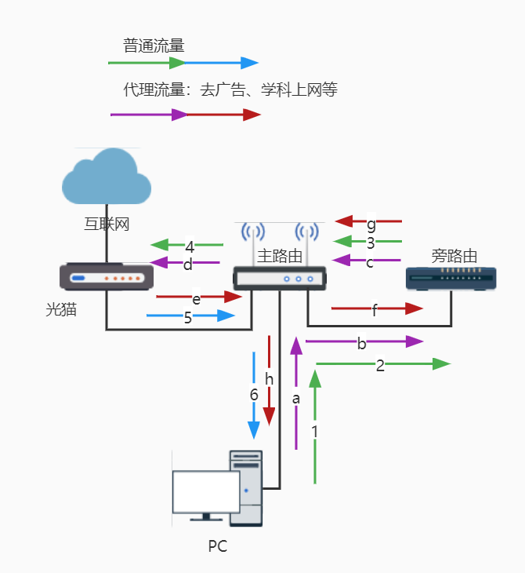
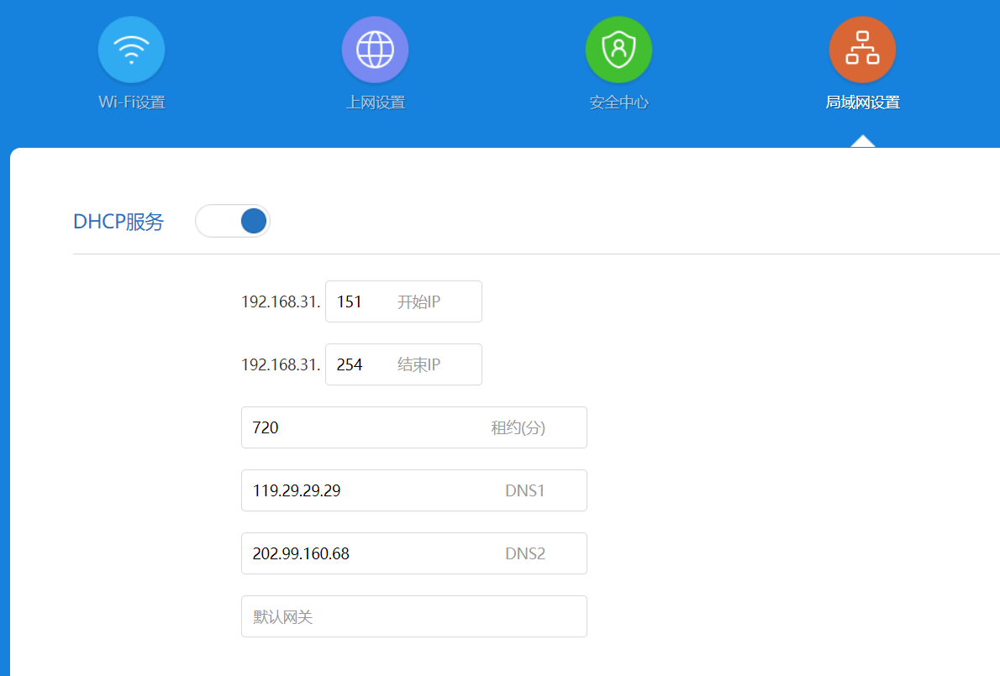

# 让旁路由丢掉 NAT

> 转载至：[关于旁路由设置后，主路由 WIFI 无法上网的问题](https://cloud.tencent.cn/developer/article/2036952)

## 前言

旁路由设置好后，手机、电脑连接主路由 WIFI，会无法访问外网。
但是，如果电脑用网线连接主路由，则可以正常上网。
这究竟是怎么一回事儿呢？

## 1. 旁路由解释

旁路由： 旁路由其实并不是路由，路由是用来连接不同网络的，最常用的就是用来连接互联网和局域网。旁路由起到的主要是网关的作用，是用来分流数据和扩展插件的。因此，严谨一点的叫法应该是 旁路网关，只是大家好像约定俗成了都叫做旁路由，所以我们这里也跟着叫旁路由，但是要明白它的核心是网关而不是路由。

## 2. 网络流量示意图


如图所示，对于普通流量，由于旁路由不修改任何内容，我们期望旁路由只转发上行数据，而下行数据由主路由直接发送给主机。对于需要代理的流量，则下行数据也得交给旁路由处理，然后才能转发给主机。

## 3. 常见问题

正如标题所言，旁路由设置好后，手机、电脑连接主路由 WIFI，会无法访问外网。如果你去搜索引擎搜索相关问题，大概率会得到这样的解决方案（甚至你搜到的配置教程就是这样教你）:

> 修改旁路由的防火墙设置
>
> 进入【网络】-【防火墙】-【自定义规则】，在最后添加以下代码
>
> iptables -t nat -I POSTROUTING -j MASQUERADE

这条规则不难理解，就是对转发的数据包进行 NAT 处理。
这样做的确可以解决无法上网问题，但很多文章都是照猫画虎，胡乱复制粘贴，没有讲清楚为什么。其实，这种方案不是最优的网络结构，这会导致即使是普通流量也进行 NAT 处理，而且上行流量、下行流量都要经过旁路由，还多两次 NAT。

## 4. 原因分析

注 1： 问题在主路由身上，而不是旁路由。  
注 2： 不是所有路由器都有此问题，取决于固件及其配置参数。  
注 3： 以下都是以 Redmi AX5 作为主路由讲述的。

数据从主机发送到主路由 AP，会经过虚拟网桥（下面简称 bridge），然后再到网桥上其他接口。
一般而言，我们常用的无线路由器（例如：Redmi AX5 ），都创建了一个名为 br-lan 的 bridge，其桥接了以太网和无线设备，我们可以用 `brctl show` 来查看：

```sh
root@XiaoQiang:~# brctl show
bridge name     bridge id               STP enabled     interfaces
br-lan          7fff.28d127e7dd8c       no              eth1
                                                        eth2
                                                        eth3
                                                        wl0
                                                        wl1
br-miot         7fff.2ed127e7dd8e       no              wl13
root@XiaoQiang:~#
```

可以看到，网桥 br-lan 桥接了 eth1、eth2、eth3、wl0、wl1 五个网卡接口(二层设备)。
另外，值得一提的是，eth1、eth2、eth3（还有用于 wan 口的 eth4）实际上是属于同一交换机上的端口（由 IPQ8075 —5 口千兆交换芯片管理），然而，在这里它们被抽象成独立的网卡接口。又因为 eth1、eth2、eth3 被桥接在一起，为了加速转发，这 3 个接口之间数据转发其实是直接在二层（链路层）走交换机芯片被快速转发的，并不经过 bridge。如果是 wl0、wl1 （二层设备，分别负责 2.4G、5G）和 eth1、eth2、eth3 之间收发数据，那就 必须经过 bridge 了，因为它们的协议都不同（一个是 IEEE802.11，一个 IEEE802.3），帧格式自然不同，必须交给 CPU 处理转换才行。

当内核变量 `net.bridge.bridge-nf-call-iptables = 1` 时，netfilter 会调用 iptables 的相关钩子函数去处理 bridge 上的数据，也就是让数据包经过一遍防火墙（看变量名字也能猜出来是干什么）。

要知道，iptables 是具有状态机制的防火墙 的配置工具（不过，我经常就把 iptables 当作防火墙）。状态机制是 iptables 中特殊的一部分，其实它不应该叫状态机制，因为它只是一种连接跟踪机制。但是，很多人都认可状态机制这个名字。连接跟踪可以让 Netfilter 知道某个特定连接的状态。

数据包经过 iptables 的 conntrack 部分时，通过分析源 ip、目的 ip、源 port、目的 port、protocol 等标记，会被记录状态信息。因为存储了状态，iptables 可以识别出哪些包属于同一个流(Stream)。

特别关键的是，特别关键的是，特别关键的是，属于一个流的包只会经过 nat 表一次。如果第一个包被允许做 NAT 或 MASQUERADE，那么余下的包都会自动地被做相同的操作。也就是说，余下的包不会再通过这个表一个一个地被 NAT，而是自动地完成，因为这样可以提高效率。如果一个流的第一个包经过 nat 表但最终没有进行地址转换，那么此流的后续包也不会进行地址转换。

现在，我们回过头来看一下（3）中提到的为什么上不了网的问题。
当电脑 WIFI 连接主路由时，想要访问 baidu.com（ip: 220.181.38.251），会从无线网卡发第一个包给 AP，到达 bridge，由于 net.bridge.bridge-nf-call-iptables = 1 ，还要被 iptables 处理一遍，被记下了状态，同时也经过了 nat 表（但是最终没能进行 NAT，因为是 br-lan 之间转发），然后由 bridge 上的 eth1（假设旁路由接入的就是 eth1）接口发送给 旁路由，我们的旁路由收到后经过检查，发现是普通流量（大陆 ip），于是原样发回给主路由，主路由收到后，会再次被 iptables 处理（这次是跨网络转发），然而发现这是已经被记录过的包，因此在处理 NAT 操作时，会和此流的第一个包进行相同操作（其实就是它自己），这个操作就是 “没修改地址”。于是，源 ip 为 192.168.31.x 的数据包被发送到了 baidu.com，当然就收不到回复了。

如果电脑是有线连接主路由，那么在 pc -> 旁路由 这个过程是直接由交换机转发过去的，没有经过 bridge，当然也没有被 iptables 记录状态。这样的话，旁路由原样发回给主路由后，经过 iptables 处理时，就属于一个流的第一个包了，能正确进行 NAT 了。

## 5. 解决方法

通过（4）中的详细分析，我们可以得知，正常的旁路由模式 和 主路由的 `net.bridge.bridge-nf-call-iptables = 1` 是不相容的，因此解决方法就是：
修改配置文件，要求 iptables 不对 bridge 的数据进行处理。

步骤如下：

ssh 登陆主路由后台，

执行命令

不过，事情还没完，经过测试，在 Redmi AX5 上（其他路由器未知），设置上述操作后，一段时间后会自动恢复 `net.bridge.bridge-nf-call-iptables = 1` 和 `net.bridge.bridge-nf-call-ip6tables = 1` 。

通过筛查 /etc 下所有配置文件，获得一个意外发现。
这两个文件 `/etc/init.d/qca-nss-ecm `、`/etc/rc.d/S19qca-nss-ecm` 文件内容一致。
内容如下：

```sh
#!/bin/sh /etc/rc.common
#
# Copyright (c) 2014, 2019 The Linux Foundation. All rights reserved.
#
# Permission to use, copy, modify, and/or distribute this software for any
# purpose with or without fee is hereby granted, provided that the above
# copyright notice and this permission notice appear in all copies.
#
# THE SOFTWARE IS PROVIDED "AS IS" AND THE AUTHOR DISCLAIMS ALL WARRANTIES
# WITH REGARD TO THIS SOFTWARE INCLUDING ALL IMPLIED WARRANTIES OF
# MERCHANTABILITY AND FITNESS. IN NO EVENT SHALL THE AUTHOR BE LIABLE FOR
# ANY SPECIAL, DIRECT, INDIRECT, OR CONSEQUENTIAL DAMAGES OR ANY DAMAGES
# WHATSOEVER RESULTING FROM LOSS OF USE, DATA OR PROFITS, WHETHER IN AN
# ACTION OF CONTRACT, NEGLIGENCE OR OTHER TORTIOUS ACTION, ARISING OUT OF
# OR IN CONNECTION WITH THE USE OR PERFORMANCE OF THIS SOFTWARE.

# The shebang above has an extra space intentially to avoid having
# openwrt build scripts automatically enable this package starting
# at boot.

START=19

get_front_end_mode() {

	config_load "ecm"
	config_get front_end global acceleration_engine "auto"

	case $front_end in
	auto)
		echo '0'
		;;
	nss)
		echo '1'
		;;
	sfe)
		echo '2'
		;;
	*)
		echo 'uci_option_acceleration_engine is invalid'
	esac
}

enable_bypass_routing() {

	local gw=$(uci -q get dhcp.lan.router)
	local dns1=$(uci -q get dhcp.lan.dns1)
	local dns2=$(uci -q get dhcp.lan.dns2)
	local lanip=$(uci -q get network.lan.ipaddr)

	[ -n "$gw" -a "$gw" != "$lanip" ] && return 0
	[ -n "$dns1" -a "$dns1" != "$lanip" ] && return 0
	[ -n "$dns2" -a "$dns2" != "$lanip" ] && return 0

	return 1
}

support_bridge() {

	enable_bypass_routing && return 1
	#NSS support bridge acceleration
	[ -d /sys/kernel/debug/ecm/ecm_nss_ipv4 ] && return 0
	#SFE doesn't support bridge acceleration
	[ -d /sys/kernel/debug/ecm/ecm_sfe_ipv4 ] && return 1
}

load_sfe() {

	[ -d /sys/module/shortcut_fe ] || insmod shortcut-fe
	[ -d /sys/module/shortcut_fe_ipv6 ] || insmod shortcut-fe-ipv6
	[ -d /sys/module/shortcut_fe_drv ] || insmod shortcut-fe-drv
}

load_ecm() {

	[ -d /sys/module/ecm ] || {

		[ ! -e /proc/device-tree/MP_256 ] && load_sfe
		insmod ecm front_end_selection=$(get_front_end_mode)
	}

	support_bridge && {

		sysctl -w net.bridge.bridge-nf-call-ip6tables=1
		sysctl -w net.bridge.bridge-nf-call-iptables=1
	}
}

unload_ecm() {

	sysctl -w net.bridge.bridge-nf-call-ip6tables=0
	sysctl -w net.bridge.bridge-nf-call-iptables=0

	if [ -d /sys/module/ecm ]; then
		#
		# Stop ECM frontends
		#
		echo 1 > /sys/kernel/debug/ecm/front_end_ipv4_stop
		echo 1 > /sys/kernel/debug/ecm/front_end_ipv6_stop

		#
		# Defunct the connections
		#
	        echo 1 > /sys/kernel/debug/ecm/ecm_db/defunct_all
		sleep 5;

		rmmod ecm
		sleep 1
	fi
}

start() {

	load_ecm

	# If the acceleration engine is NSS, enable wifi redirect.
	[ -d /sys/kernel/debug/ecm/ecm_nss_ipv4 ] && sysctl -w dev.nss.general.redirect=1

	support_bridge && {

		echo 'net.bridge.bridge-nf-call-ip6tables=1' >> /etc/sysctl.d/qca-nss-ecm.conf
		echo 'net.bridge.bridge-nf-call-iptables=1' >> /etc/sysctl.d/qca-nss-ecm.conf
	}
}

stop() {

	# If the acceleration engine is NSS, disable wifi redirect.
	[ -d /sys/kernel/debug/ecm/ecm_nss_ipv4 ] && sysctl -w dev.nss.general.redirect=0

	sed '/net.bridge.bridge-nf-call-ip6tables=1/d' -i /etc/sysctl.d/qca-nss-ecm.conf
	sed '/net.bridge.bridge-nf-call-iptables=1/d' -i /etc/sysctl.d/qca-nss-ecm.conf

	unload_ecm
}
```

阅读上面脚本，不难发现，就是这个脚本修改的值。其中，`support_bridge` 这个函数比较关键，它是其他修改 `net.bridge.bridge-nf-call-iptables = 1` 操作的先决判断条件。这个 `support_bridge` 的意思就是 `iptables` 要不要对网桥流量处理（我猜的）。
另一个比较关键的函数就是 `enable_bypass_routing`，这是什么？使能旁路由？再多阅读一下函数的具体内容，就真相大白了。
enable_bypass_routing 通过判断 “dhcp 的网关是否等于路由器 ip”、“dhcp 的 dns1 是否等于路由器 ip”、“dhcp 的 dns2 是否等于路由器 ip” 来决定返回 1 或 0 。
而 support_bridge 又靠 enable_bypass_routing 返回值决定
（通过查看目录，/sys/kernel/debug/ecm/ecm_nss_ipv4 存在，而 /sys/kernel/debug/ecm/ecm_sfe_ipv4 不存在）。

原来，路由器内部早就定义好了旁路由检测方式。
明白这些，就简单多了，登陆 Redmi AX5 网页后台，在 DHCP 参数页，设置一个或两个 DNS 为非 192.168.31.1 的 IP 就行了，当然把默认网关改成旁路由也可以，不过我不想那样。
然后保存重启路由器就行了。
此方法应该也适用 Xiaomi/Redmi 其他路由器（我猜的 😁）

