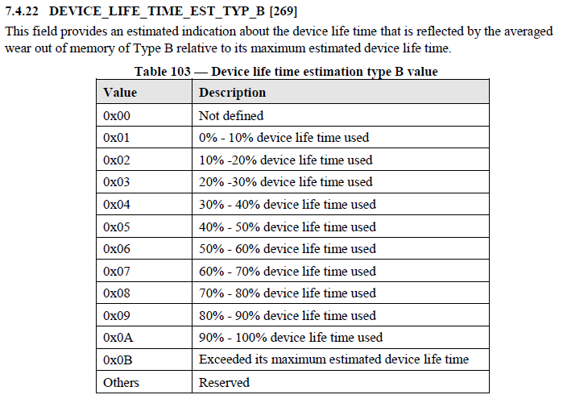
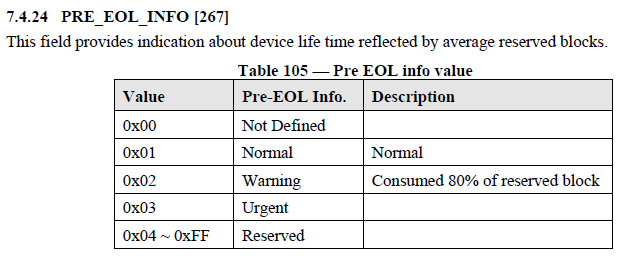

# 玩客云刷 armbian 并安装 homeassistant

## 一、准备工作

- 玩客云设备一套**机子、电源适配器、网线**（我的是赚钱宝三代，也就是 1.3 版本）

- 一条 USB 公对公的线；电脑支持 type c 接口的话也可以用手机数据线

- 十字螺丝刀、镊子、手机取卡针、小翘板、吹风机、带开关的排插

## 二、拆机刷机

### 1.拆机操作

开拆吧，用风枪或者吹风机吹面板（时间稍微久一点），吹热后轻轻撬开

> https://zhuanlan.zhihu.com/p/665581814?utm_id=0


拆除面板后，把螺丝扭开，就可以把主板取出来了

### 2.短接点

> 玩客云主板分为两种：v1.1 和 v1.3 版本； 作者：Saenice https://www.bilibili.com/read/cv21738633/ 出处：bilibili


### 3.刷机

Amlogic USB Burning Tool 是一款用于在基于 Amlogic 的设备上刷新固件镜像的免费且简单的工具。它通常用于固件升级、降级、设备恢复和安装自定义固件。该工具兼容 Windows 操作系统，包括 Windows XP、Windows 7、Windows 8 和 Windows 10。但请注意，这个工具并不原生支持 Mac 或 Linux 操作系统，虽然你可以尝试使用虚拟机或仿真器在 Mac 或 Linux 计算机上运行 Windows，然后使用该工具

我的 v1.3 版本，下载烧录软件为 v3 版本无法使用，更换最新 v2 版本后读取到设备，使用 amd 笔记本烧录就提示失败，更换 intel 设备，成功开始烧录卡在 97 失败，尝试多个版本 2.1.6.8 版本成功烧录

> 请访问 Android MTK 网站(https://androidmtk.com/download-amlogic-usb-burning-tool)下载工具

> 玩客云 armbian 地址https://github.com/hzyitc/armbian-onecloud?tab=readme-ov-file
> 根据自己的需求下载对应的镜像

**使用 Amlogic USB Burning Tool 刷新固件的大致步骤包括：**

1. 在你的 Windows 计算机上下载并安装 Amlogic USB Burning Tool。
2. 下载与你的设备兼容的固件文件。
3. 启动 Amlogic USB Burning Tool 并点击“文件”>“导入镜像”来加载固件文件。
4. 使用 USB 线将你的 Amlogic 设备连接到计算机，并确保设备处于恢复模式或引导程序模式（短接后通电）。
5. 工具应该会检测到你的设备，你可以点击“开始”按钮开始刷新过程。
6. 等待过程完成后，你的设备将会重启并安装了新的固件。

具体步骤和要求可能会根据你的设备型号和固件有所不同。始终遵循设备制造商提供的具体说明或支持论坛中的指南。在使用工具之前，建议检查设备制造商的网站或支持论坛以获取兼容性信息。
:::tip 提示
靠近 HDMI 接口的的 USB 口【USB1】，为对公刷机线插线接口
:::

### 4.玩客云 Armbian LED 灯

> 可修改 LED 灯颜色 0 为关闭, 1 为开启 作者：Saenice https://www.bilibili.com/read/cv21700714/ 出处：bilibili

```shell
# 修改 LED 灯颜色 0 为关闭, 1 为开启
配置即时生效：例图【蓝色】
echo 0 > /sys/class/leds/onecloud:red:alive/brightness
echo 1 > /sys/class/leds/onecloud:blue:alive/brightness
echo 0 > /sys/class/leds/onecloud:green:alive/brightness
```

### 5.查看 eMMC 健康度

首先安装 `mmc-utils`

> 如果系统没有默认安装的话

`sudo apt install mmc-utils`

查看 mmcblk0 的寿命，这里假定设备名为 mmcblk0，实际设备名使用 lsblk 命令很容易确定

`sudo mmc extcsd read /dev/mmcblk0`

过滤一下，只看寿命相关信息

```sh
sudo mmc extcsd read /dev/mmcblk0 | grep Life
eMMC Life Time Estimation A [EXT_CSD_DEVICE_LIFE_TIME_EST_TYP_A]: 0x01
eMMC Life Time Estimation B [EXT_CSD_DEVICE_LIFE_TIME_EST_TYP_B]: 0x03
```

越靠近 0 约好，0x01 表示 0-10%之间，0x0A 表示 90%-100%之间，0x0B 就表示完蛋了。

可以参考下面图片：



## 三、安装 docker

使用 Docker 安装 Home Assistant 的原因包括：

1. **隔离性**：Docker 容器为 Home Assistant 提供了一个隔离的环境，减少了与其他应用程序或系统服务的冲突。
2. **易于更新**：通过 Docker，更新 Home Assistant 变得简单，只需拉取最新的 Docker 镜像并重新启动容器即可。
3. **便携性**：Docker 容器可以在任何支持 Docker 的平台上运行，使得 Home Assistant 的安装和迁移更加灵活。
4. **易于管理**：Docker 提供了管理容器的工具和命令，使得监控和维护 Home Assistant 实例更加方便。

更新系统`apt update && apt upgrade -y`,如果网络缓慢可以参考下面网站修改源

> https://mirrors.tuna.tsinghua.edu.cn/help/debian/

使用`apt install docker.io`或者官方脚本:

```shell
curl -fsSL https://get.docker.com -o get-docker.sh
sudo sh ./get-docker.sh
```

或者添加 docker 源然后通过 apt 安装，这么操作有利于后期管理：

```sh
# Add Docker's official GPG key:
sudo apt-get update
sudo apt-get install ca-certificates curl
sudo install -m 0755 -d /etc/apt/keyrings
sudo curl -fsSL https://download.docker.com/linux/debian/gpg -o /etc/apt/keyrings/docker.asc
sudo chmod a+r /etc/apt/keyrings/docker.asc

# Add the repository to Apt sources:
echo \
  "deb [arch=$(dpkg --print-architecture) signed-by=/etc/apt/keyrings/docker.asc] https://download.docker.com/linux/debian \
  $(. /etc/os-release && echo "$VERSION_CODENAME") stable" | \
  sudo tee /etc/apt/sources.list.d/docker.list > /dev/null
sudo apt-get update
sudo apt-get install docker-ce docker-ce-cli containerd.io docker-buildx-plugin docker-compose-plugin

```

安装后执行 docker info 查看是否安装成功,有版本号就是成功了
进行下一步前可以通过`date -R`查看一下本机时区，如果不是正确的可以通过下面命令修改：

```shell
timedatectl set-timezone Asia/Shanghai
```

## 四、安装 Home Assistant

使用 Docker 安装 Home Assistant 的步骤包括：

1. 拉取 Home Assistant 的 Docker 镜像。
2. 创建一个配置文件，指定 Home Assistant 的配置和所需的服务。
3. 启动 Home Assistant 容器。
4. 访问 Home Assistant 的 Web 界面，开始配置和控制你的家庭自动化系统。

### 1. 拉取 Home Assistant 的 Docker 镜像

使用以下命令拉取 Home Assistant 的 Docker 镜像：

```shell
docker pull homeassistant/home-assistant:latest
```

安装 Docker 软件后，您可以直接通过 docker pull 命令拉取镜像。如您未配置镜像加速源，直接拉取 DockerHub 中的镜像，通常下载速度会比较慢。
为此，我们推荐您使用腾讯云 Docker 镜像源加速镜像下载。不同操作系统的详细操作步骤略有区别，请使用对应的操作步骤进行配置。
`vim /etc/docker/daemon.json`

```vim
{
    "registry-mirrors": [
        "https://mirror.ccs.tencentyun.com",
        "https://hub-mirror.c.163.com",
        "https://mirror.baidubce.com"
    ]
}
```

重新加载配置文件并重启 docker

```bash
systemctl daemon-reload
systemctl restart docker
```

拉取完成后，可以使用`docker images`命令查看已下载的镜像。

### 2. 创建配置文件夹

放置在 Home Assistant 的配置目录
使用以下命令创建配置文件：

```shell
mkdir -p /root/homeassistant/config/
```

### 3. 启动 Home Assistant 容器

使用以下命令启动 Home Assistant 容器：

```shell
docker run -d \
  --name homeassistant \
  --restart unless-stopped \
  -e TZ="Asia/Shanghai" \
  -v /root/homeassistant/config:/config \
  --network=host \
  homeassistant/home-assistant:latest
```

这条命令是用来启动一个 Home Assistant 容器实例的 Docker 命令。Home Assistant 是一个开源的家庭自动化平台，允许你连接和自动化多种家庭设备和服务。下面是命令的详细说明：

- `docker run -d`: 这个命令用来启动一个新的容器。`-d` 参数表示以“分离模式”运行容器，即容器在后台运行，不会占用当前的命令行界面。

- `--name homeassistant`: 这个参数给容器指定一个名字，这里命名为 `homeassistant`，方便以后的管理（比如启动、停止、删除容器时）。

- `--privileged`: 这个参数给容器提供了额外的权限，使其能够访问和管理宿主机的设备。这在一些需要直接与硬件交互的场景中是必要的，比如访问宿主机的 GPIO 接口等。

- `--restart=unless-stopped`: 这个参数设置容器的重启策略。这里指定为 `unless-stopped`，意味着除非用户手动停止容器，否则容器会在退出时自动重启。

- `-e TZ="Asia/Shanghai"`: 这个参数用来设置环境变量。这里设置 `TZ`（时区）为 `Asia/Shanghai`，确保容器内的时间与中国大陆的本地时间同步。

- `-v /root/homeassistant/config:/config`: 这个参数用来挂载卷。它将宿主机的 `/root/homeassistant/config` 目录挂载到容器内的 `/config` 目录。这样，容器内部的 Home Assistant 配置文件会直接存储在宿主机上，便于管理和备份。

- `--network=host`: 这个参数使容器使用宿主机的网络堆栈。这通常用于需要容器访问宿主机网络接口的场景，在某些类型的网络服务中特别有用。

- `homeassistant/home-assistant:latest`: 这是要启动的 Docker 镜像的名称和标签。这里使用的是 `homeassistant/home-assistant` 镜像的 `latest` 版本，即最新版本。

总的来说，这个命令会在你的系统上以分离模式启动一个最新版本的 Home Assistant 容器，容器会使用宿主机的网络和特定的时区设置，并将配置文件存储在宿主机指定的目录中。

你可以创建一个 docker-compose.yml 文件，并按照以下示例填写相应的配置：

```yaml
version: '3'
services:
  homeassistant:
    container_name: homeassistant
    image: homeassistant/home-assistant:latest
    restart: unless-stopped
    network_mode: host
    volumes:
      - /root/homeassistant/config:/config
    environment:
      - TZ=Asia/Shanghai
```

并通过如下命令启动停止：

```bash
docker-compose up -d
docker-compose stop
```

### 4. 访问 Home Assistant 的 Web 界面

Home Assistant 容器启动后，可以通过浏览器访问`http://<Docker 主机 IP>:8123`来访问 Home Assistant 的 Web 界面。

**安装 hacs**

> HACS（Home Assistant Community Store）是一个用于 Home Assistant 的第三方集成管理器，它允许用户轻松发现、安装和管理自定义集成和插件。以下是安装 HACS 的基本步骤：

1. 获取 HACS 安装文件
   访问 HACS 官方网站 或 HACS GitHub 仓库 获取最新的安装文件。
2. 将 HACS 文件解压到 Home Assistant 配置目录
   将下载的 HACS 文件解压缩。
   把 hacs 文件夹放入你的 Home Assistant 配置目录下的 custom_components 文件夹中。如果 custom_components 文件夹不存在，你需要手动创建它。
3. 重启 Home Assistant
   在对配置文件进行更改后，你需要重启 Home Assistant 以加载新的集成。
4. 在 Home Assistant 中配置 HACS
   重启 Home Assistant 后，进入配置 -> 集成页面。
   点击右下角的“添加集成”按钮，搜索并选择 HACS。
   按照提示完成 HACS 的安装和配置。
5. 获取 GitHub 个人访问令牌（如果需要）
   在某些情况下，HACS 需要一个 GitHub 个人访问令牌以访问 GitHub API。你可以在 GitHub 设置页面 生成一个新的令牌。
   在生成令牌时，你不需要选择任何特定的作用域，直接生成即可。
   在 HACS 配置过程中，如果被要求提供，就输入这个令牌。

另外也可以访问(https://hacs.xyz/docs/setup/download)查看官方安装方法。
:::tip 提示
如果你的插件不多，比如我就安装两个，且访问 github 网络环境不是特别友好，其实没有必要安装 HACS，可以去插件页面手动下载安装。
:::
通过 HACS 上面安装 xiaomi-miot 或者访问(https://github.com/al-one/hass-xiaomi-miot)下载后解压到`custom_components`目录下。
登录小米账号后即可自动获取设备开始你的 home assistant 之旅。
