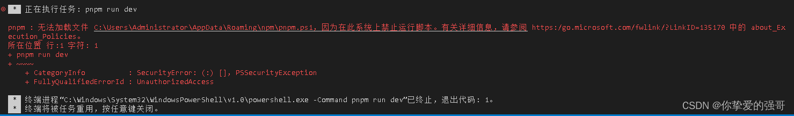
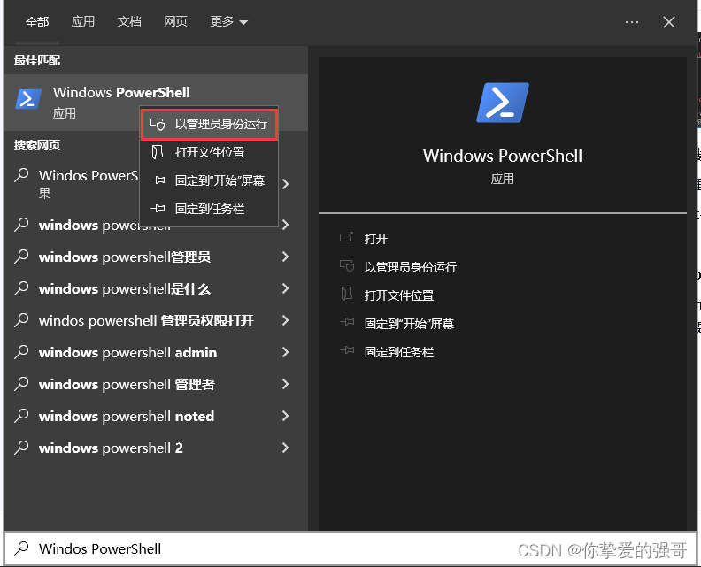
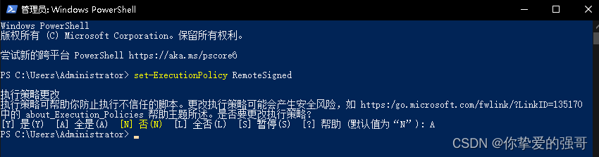

# vscode 无法运行 npm 脚本

## 1、pnpm : 无法加载文件 C:\Users\Administrator\AppData\Roaming\npm\pnpm.ps1，因为在此系统上禁止运行脚本。

## 2、win+s 在系统中搜索框 输入“Windos PowerShell”右击“管理员身份运行”

## 3、输入“set-ExecutionPolicy RemoteSigned”回车,根据提示输入 A，回车

## 4、再次回到 pnpm -v 执行成功。

不只是 pnpm 命令，包括 cnpm、yarn 等这些命令，如果执行时，报这样的错误，都可以通过此方法解决。前提是，如果是用 npm 命令来安装这些 CLI 命令工具，必须安装到全局环境中，才能生效。

## 5、科普 window.powershell 知识点：

Windows 给 powershell 设定了一个叫“执行策略”的东西。

为什么要弄这么一个执行策略呢，因为 powershell 能做的事情太多了，为了避免一些恶意脚本直接运行，一般家用的 windows 系统默认将执行策略设置成了“Restricted”，即受限制的。
