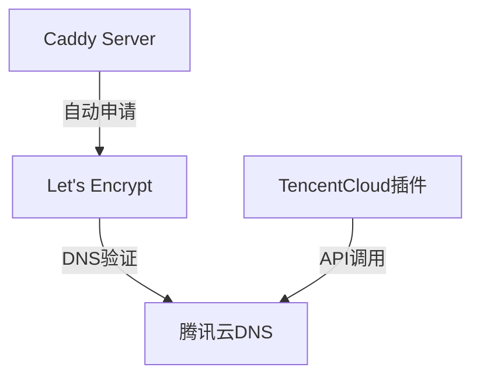
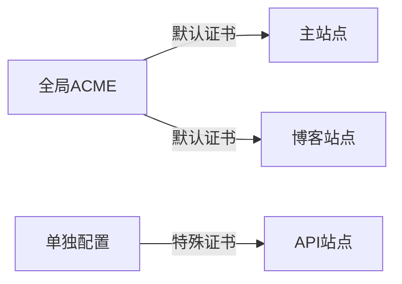

# 使用 Caddy TencentCloud 插件实现全自动 SSL 证书配置

## 前言

在云原生时代，HTTPS 已成为网站安全的基本要求。传统手动申请和更新 SSL 证书的方式效率低下，而 Caddy 服务器凭借其自动 HTTPS 特性彻底改变了这一流程。本文将介绍如何通过 Caddy 的 TencentCloud DNS 插件，在腾讯云环境下实现全自动的 SSL 证书申请和续期。

## 一、技术方案概述



## 二、详细实现步骤

### 1. 编译包含 TencentCloud 插件的 Caddy

通过 Docker 自定义构建：

```dockerfile
# Dockerfile
FROM caddy:builder AS builder

RUN xcaddy build \
    --with github.com/caddy-dns/tencentcloud

FROM caddy:latest
COPY --from=builder /usr/bin/caddy /usr/bin/caddy
```

构建命令：

```bash
docker build -t caddy-tencentcloud .
```

### 2. 腾讯云权限配置（最小化原则）

1. 登录腾讯云访问管理控制台
2. 创建子账号并分配「DNS 全读写」权限
3. 生成 API 密钥（SecretId/SecretKey）

权限策略示例：

```json
{
  "version": "2.0",
  "statement": [
    {
      "effect": "allow",
      "action": [
        "dnspod:CreateRecord",
        "dnspod:DescribeRecordList",
        "dnspod:ModifyRecord",
        "dnspod:DeleteRecord"
      ],
      "resource": "*"
    }
  ]
}
```

### 3. Caddyfile 配置

```caddyfile
example.com {
    tls {
        dns tencentcloud {env.TENCENTCLOUD_SECRET_ID} {env.TENCENTCLOUD_SECRET_KEY}
    }

    respond "Hello, 自动HTTPS!"
}
```

### 4. 启动容器

```bash
docker run -d \
  -p 80:80 -p 443:443 \
  -e TENCENTCLOUD_SECRET_ID=AKIDxxxx \
  -e TENCENTCLOUD_SECRET_KEY=xxxx \
  -v $PWD/Caddyfile:/etc/caddy/Caddyfile \
  --name caddy \
  caddy-tencentcloud
```

## 三、进阶配置：全局 ACME 设置

### 1. 优化后的 Caddyfile 结构

```caddyfile
{
    acme_dns tencentcloud {
        secret_id {env.TENCENTCLOUD_SECRET_ID}
        secret_key {env.TENCENTCLOUD_SECRET_KEY}
    }
}

example.com {
    tls your@email.com  # 使用全局ACME配置
    respond "Hello, 全站自动化HTTPS！"
}

api.example.com {
    tls {
        dns tencentcloud {env.TENCENTCLOUD_SECRET_ID} {env.TENCENTCLOUD_SECRET_KEY}
    }
    reverse_proxy localhost:8080
}
```

### 2. 两种配置方式的区别

| 配置方式   | 作用域   | 适用场景     | 优先级 |
| ---------- | -------- | ------------ | ------ |
| 全局 ACME  | 所有站点 | 统一管理证书 | 低     |
| 站点级 DNS | 单个站点 | 特殊域名处理 | 高     |

### 3. 混合使用场景



### 4. 重要注意事项

1. **环境变量注入**：

   ```bash
   # 更安全的Docker启动方式（使用--env-file）
   echo "TENCENTCLOUD_SECRET_ID=AKIDxxxxxx" > caddy.env
   echo "TENCENTCLOUD_SECRET_KEY=xxxxxx" >> caddy.env
   docker run --env-file caddy.env ...
   ```

2. **证书缓存策略**：

   ```caddyfile
   {
       acme_ca https://acme-staging-v02.api.letsencrypt.org/directory
       acme_dns tencentcloud {
           secret_id {env.TENCENTCLOUD_SECRET_ID}
           secret_key {env.TENCENTCLOUD_SECRET_KEY}
       }
       email your@email.com  # 全局通知邮箱
   }
   ```

3. **调试命令**：
   ```bash
   # 检查ACME申请状态
   docker exec caddy cat /data/caddy/.local/share/caddy/acme/acme-v02.api.letsencrypt.org/sites/*/certificates.json
   ```

## 四、关键注意事项

1. **安全实践**：

   - 永远不要将密钥直接写入 Caddyfile
   - 使用 Docker secret 或 K8s Secret 管理敏感信息
   - 限制子账号 API 调用 IP 白名单

2. **调试技巧**：

   ```bash
   docker logs -f caddy
   curl -I https://example.com
   ```

3. 证书存储：
   Caddy 默认将证书存储在`$HOME/.local/share/caddy`，建议通过 volume 持久化：
   ```bash
   -v caddy_data:/data
   -v caddy_config:/config
   ```

## 五、方案优势

1. 完全自动化：证书申请、验证、续期全自动完成
2. 零停机更新：证书到期前自动轮换
3. 广泛兼容：支持通配符证书和多域名证书
4. 符合 ACME 协议标准

## 结语

通过 Caddy 与云厂商 DNS 插件的结合，我们实现了 HTTPS 配置的完全自动化。这种方案特别适合：

- 动态 IP 环境的服务
- 大规模微服务架构
- CI/CD 自动化部署场景

下次当你需要为新的子域名配置 HTTPS 时，只需要修改 Caddyfile 并重启服务，剩下的就交给 Caddy 吧！

---

## 优化建议：

1. 可以增加性能测试数据
2. 补充与 Certbot 方案的对比
3. 添加故障排查章节
4. 加入监控方案（证书过期告警）
