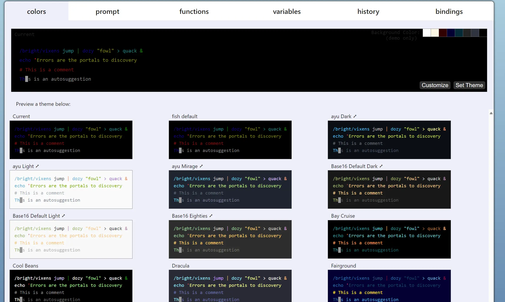

# Fish Shell 的安装与基本配置

> Finally, a command line shell for the 90s\_

Fish Shell 是一款智能且用户友好的命令行界面，适用于 Linux、macOS 及其他类 Unix 系统。它以提高用户效率和改善命令行使用体验为目标，通过高级特性如自动建议、语法高亮和易于理解的脚本语言来实现这一点。

之前一直使用`oh-my-zsh`，这个项目还是很棒的，不过这个项目越来越庞大导致现在启动有点慢了。我在网上看到有人也推荐`zim`，不过我去了解一下还是放弃了，这个项目目前名叫[zimfw](https://github.com/zimfw/zimfw)不过是个新开的项目，因为之前的项目删库了。有点担心新项目未来也删库，索性直接用上已经被安利了很久的 FISH。

## 安装 Fish Shell

1. **Ubuntu/Debian**：

   ```shell
   sudo apt-add-repository ppa:fish-shell/release-3
   sudo apt update
   sudo apt install fish
   ```

2. **macOS**：

   ```shell
   brew install fish
   ```

3. **其他系统**：访问官方文档获取更多安装指南。

4. **配置**
   fish 设为默认 shell

```shell
chsh -s /usr/bin/fish
reboot
```

::: tip 提示

若总是报错`chsh: PAM: Authentication failure`

直接修改用户的配置

`vim /etc/passwd/`

查看系统当前使用的 shell

```fish
ubuntu% echo $SHELL
/usr/bin/fish
```

表明已经将 zsh 设置为默认 shell

:::
可视化配置：`fish_config`


::: tip 提示

如果是连接的远程服务器可能无法打开，这个时候可以在本地配置好后把`prompt`复制到远程服务器上
`~/.config/fish/functions/fish_prompt.fish`
:::

5. **个性化**

配置 nano 的 tab 为现在更常见的 4 空格

```fish
nano ~/.nanorc

# .nanorc
set tabsize 4
```

配置 alias 在 Fish shell 中，你可以通过创建一个名为 rm 的函数来模拟 rm -i 的行为。这样，每次你运行 rm 时，它都会以交互模式运行，提示你确认是否真的要删除文件。

```fish
nano ~/.config/fish/config.fish

# .config/fish/config.fish
if status is-interactive
    # Commands to run in interactive sessions can go here
    function rm
        command rm -i $argv
    end
end
```

## Fisher 安装

[Fisher](https://github.com/jorgebucaran/fisher) 是一个 Fish Shell 的包管理器，用于安装和管理第三方软件包。

> A plugin manager for [Fish](https://fishshell.com/)—your friendly interactive shell. [Snag fresh plugins!](https://github.com/jorgebucaran/awsm.fish#readme)

```fish
curl -sL https://raw.githubusercontent.com/jorgebucaran/fisher/main/functions/fisher.fish | source && fisher install jorgebucaran/fisher
```

### 插件推荐

由于 fish 自带了很多功能，属于开箱即用的状态所以也没啥推荐的（自动建议、语法高亮都自带了，其中 sudo 键位为`ALT+s`），不过因为我习惯了 Z 插件，同时需要 nodejs 环境，所以安装了这两个。

- nvm:`fisher install jorgebucaran/nvm.fish`

- z:`fisher install jethrokuan/z`

## 结语

Fish Shell 和 Fisher 提供了丰富的扩展和自定义选项，通过这些工具，你可以极大地提升命令行的使用体验和效率。
