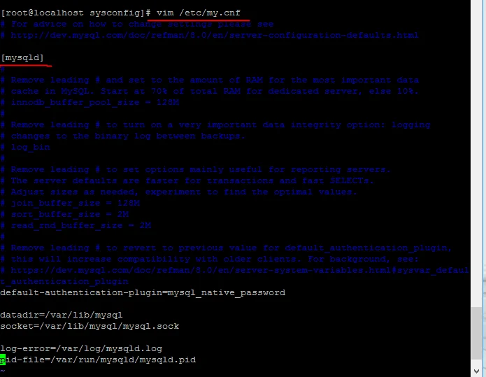
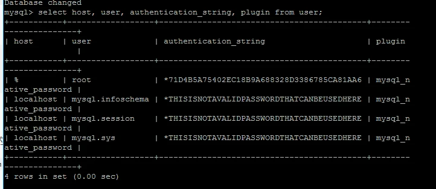

# Centos7 重置 Mysql8 root 密码

安装完 最新版的 mysql8 后忘记了密码，想重置 root 密码；找了网上好多资料都不尽相同，根据自己的问题总结如下：

## 一、修改配置文件免密码登录 mysql

### 1.1 打开配置文件

`vim /etc/my.cnf`



### 1.2 在 [mysqld]最后加上如下语句 并保持退出文件

`skip-grant-tables`


### 1.3 重启 mysql 服务

`service mysqld restart`

## 二、免密登录 mysql，直接在命令行上输入

```
mysql
//或者
mysql -u root -p
//password直接回车
```

## 三、给 root 用户重置密码

### 3.1 首先查看当前 root 用户相关信息，在 mysql 数据库的 user 表中

```sql
select host, user, authentication_string, plugin from user;
```

host: 允许用户登录的 ip‘位置’%表示可以远程；

user:当前数据库的用户名；

authentication_string: 用户密码；在 mysql 5.7.9 以后废弃了 password 字段和 password()函数；

plugin： 密码加密方式；



### 3.2 如果当前 root 用户 authentication_string 字段下有内容，先将其设置为空

```sql
use mysql;
update user set authentication_string='' where user='root';
```

### 3.3 退出 mysql, 删除/etc/my.cnf 文件最后的 skip-grant-tables 重启 mysql 服务

### 3.4 使用 root 用户进行登录，因为上面设置了 authentication_string 为空，所以可以免密码登录

```
mysql -u root -p
passwrod:直接回车;
```

### 3.5 使用 ALTER 修改 root 用户密码

```sql
 ALTER user 'root'@'localhost' IDENTIFIED BY 'Qian123#'
```

至此修改成功； 重新使用用户名密码登录即可。

::: tip 提示
一定不要采取如下形式改密码：

```sql
use mysql;
update user set authentication_string="newpassword" where user="root";
```

这样会给 user 表中 root 用户的 authentication_string 字段下设置了 newpassword 值；

当再使用 ALTER USER 'root'@'localhost' IDENTIFITED BY 'newpassword'时会报错的；

因为 authentication_string 字段下只能是 mysql 加密后的 41 位字符串密码；其它的会报格式错误；
:::
