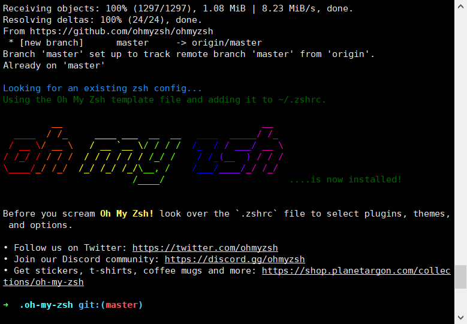

# oh-my-zsh 安装与基本配置

zsh 是一个 Linux 下强大的 shell, 由于大多数 Linux 产品安装以及默认使用 bash shell, 但是丝毫不影响极客们对 zsh 的热衷, 几乎每一款 Linux 产品都包含有 zsh，通常可以用 apt、urpmi 或 yum 等包管理器进行安装

zsh 是 bash 的增强版，其实 zsh 和 bash 是两个不同的概念，zsh 更加强大

通常 zsh 配置起来非常麻烦，且相当的复杂，所以 oh-my-zsh 是为了简化 zsh 的配置而开发的，因此 oh-my-zsh 算是 zsh 的配置

## 1 、准备

**查看当前系统使用的 shell**

```shell
ubuntu@ubuntu:~$ echo $SHELL
/bin/bash
```

**查看系统自带哪些 shell**

```shell
ubuntu@ubuntu:~$ cat /etc/shells
# /etc/shells: valid login shells
/bin/sh
/bin/bash
/usr/bin/bash
/bin/rbash
/usr/bin/rbash
/bin/dash
/usr/bin/dash
/usr/bin/tmux
/usr/bin/screen
```

## 2、安装 zsh

**开始安装**

`sudo apt install zsh -y`

**再次查看**

```shell
ubuntu@ubuntu:~$ cat /etc/shells
# /etc/shells: valid login shells
/bin/sh
/bin/bash
/usr/bin/bash
/bin/rbash
/usr/bin/rbash
/bin/dash
/usr/bin/dash
/usr/bin/tmux
/usr/bin/screen
/bin/zsh
/usr/bin/zsh
```

表明已经安装好 zsh

**配置**

zsh 设为默认 shell

```shell
chsh -s /bin/zsh
reboot
```

::: tip 提示

若总是报错`chsh: PAM: Authentication failure`
直接修改用户的配置
`vim /etc/passwd/`

查看系统当前使用的 shell

```shell
ubuntu% echo $SHELL
/bin/zsh
```

表明已经将 zsh 设置为默认 shell

:::

## 3、安装 oh-my-zsh

`sh -c "$(curl -fsSL https://raw.github.com/robbyrussell/oh-my-zsh/master/tools/install.sh)"`

或者

`sh -c "$(wget https://raw.github.com/robbyrussell/oh-my-zsh/master/tools/install.sh -O -)"`

如果 github 无法连接，可以使用 gitee

```sh
https://gitee.com/mirrors/oh-my-zsh/raw/master/tools/install.sh
```

出现下面界面成功安装：



## 4、个性化

### 1.主题

`vim ~/.zshrc`


使用下面命令使配置生效，我喜欢**ys**

`source ~/.zshrc`

安装字体解决 zsh 乱码问题

`apt install fonts-powerline -y`

### 2.插件

ohmyzsh 强大的地方就强大在其有丰富的插件，但是我个人推荐的插件不多 6 个，其中 4 个是自带的 2 个需要自己安装（`https://github.com/zsh-users`上有各种插件可以自行选择）

```shell
git clone https://github.com/zsh-users/zsh-syntax-highlighting.git ${ZSH_CUSTOM:-~/.oh-my-zsh/custom}/plugins/zsh-syntax-highlighting

git clone https://github.com/zsh-users/zsh-autosuggestions ${ZSH_CUSTOM:-~/.oh-my-zsh/custom}/plugins/zsh-autosuggestions
```

**安装完成之后需要配置 zsh 的配置文件**

`vim ~/.zshrc`

**打开文件之后在 plugins 中增加以下内容：**

```shell
plugins=(
        git
        sudo
        z
        extract
        zsh-syntax-highlighting
        zsh-autosuggestions
        history
)
```

- git：常用的 git 命令缩写

- sudo: 插件是一个很方便的小工具，它允许你通过在命令行前面加上一个特定的字符（默认是两次按 Esc 键）来自动添加 sudo 前缀到上一条命令。这样就不用重新输入整个命令来以超级用户权限执行它了。

- z：自动跳转（及其推荐使用）

- extract：解压通过 x 命令解压任何类型的压缩文件

- zsh-syntax-highlighting：命令高亮（及其推荐）

- zsh-autosuggestions：命令自动补齐（及其推荐）

- history：查看历史命令

**启用配置文件：**

```bash
source ~/.zshrc
```
