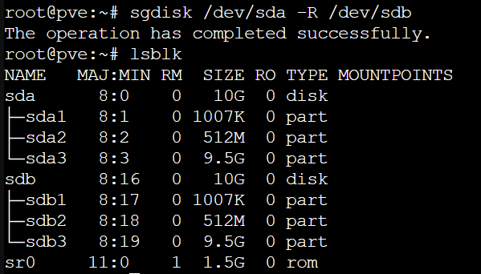

# PVE8- ZFS 阵列重组 替换硬盘，修复 efi 启动引导

### 故障表现

在 PVE 的 ZFS 上创建的`mirror-0`故障，磁盘离线，显示`DEGRADED`状态。设备状态显示`removed`状态。


### 解决流程

1. **准备新的硬盘**：关闭 PVE 当前节点并插入并替换损坏硬盘（新硬盘容量相同）。
2. **检查新插入的硬盘**：开机在硬盘列表中检查新插入的硬盘识别与否。
3. **初始化新硬盘**：在磁盘选项卡中对新插入的硬盘进行 GPT 初始化。
4. **通过 SSH 连接 PVE 进行操作**：

   1.使用`sgdisk`命令将健康的启动硬盘`sda`分区复制到新硬盘`sdb`。
   

   `sgdisk /dev/sda -R /dev/sdb`

   

   2.随机生成新的磁盘 GUID`sgdisk -G /dev/sdb`

   3.查询最大分区`sdb3`的 id
   `ls -l /dev/disk/by-id`

   

   4.重建 zfs 阵列
   `zpool replace -f rpool scsi-3600224808e059fe238b98559ac057f7d-part3 scsi-3600224808d6a82d72adf402d10ca51ae-part3`
   

:::tip 提示
如果不是使用的 id 号组建的 zfs，比如参数直接是`/dev/sdb3`这样，那么需要使用`zdb`命令查看损坏硬盘路径对应的 GUID，通过 GUID 来替换。
:::

5.格式化新硬盘 EFI 分区：

```bash
proxmox-boot-tool format /dev/sdb2
proxmox-boot-tool init /dev/sdb2
proxmox-boot-tool refresh
```

### 大功告成

重启系统确认服务器正常。
