# ubuntu-20.04.4-server 安装与基本配置

## 问题产生背景

由于众所周知的[原因](https://blog.centos.org/2020/12/future-is-centos-stream/)，业务需要从 centos 迁移到其它操作系统了；本人还是觉得非常可惜，这么久以来这个系统一直是大家的首选，其实已经用习惯了

Ubuntu-server 成为了本次迁移的首选，本文基于[ubuntu-20.04.4-server](https://ubuntu.com/download/server)从安装到配置进行总结

## 1、安装

点击上方系统链接进入官网镜像下载界面，下载完成后根据自己实际使用方式选择安装

### 1.选择语言

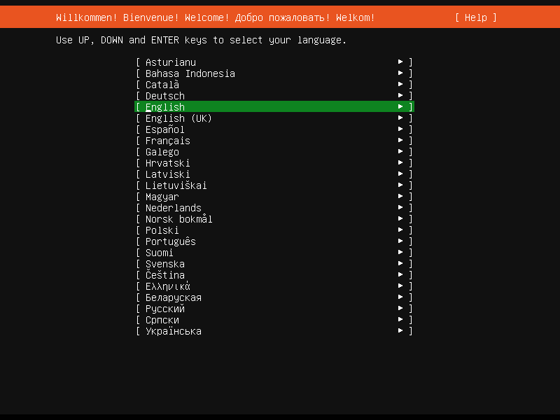

### 2.设置键盘

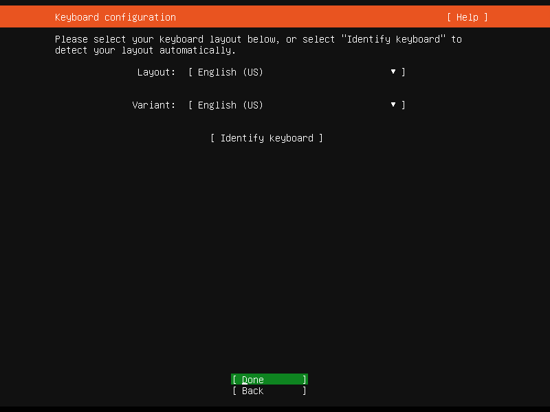

### 3.配置网络

如果你所处的网络没有 DHCP，需要静态 IP；在此处键入对应值即可


### 4.配置代理

没有需求可直接跳过

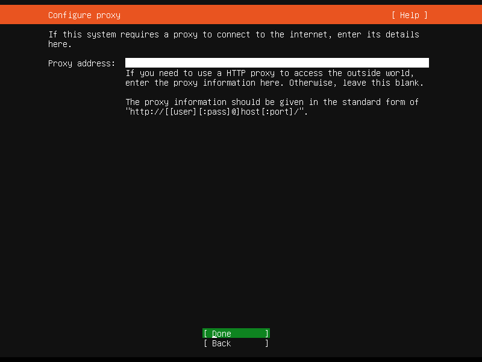

### 5.设置源地址

这个可以配置阿里云(http://mirrors.aliyun.com/ubuntu/)，下载加速

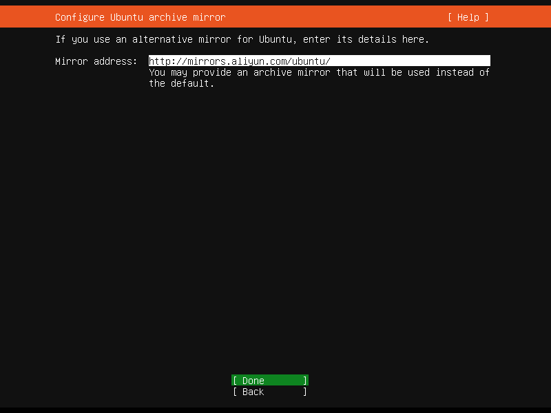

### 6.配置磁盘分区

一般默认即可，如果有特殊需求自行设置


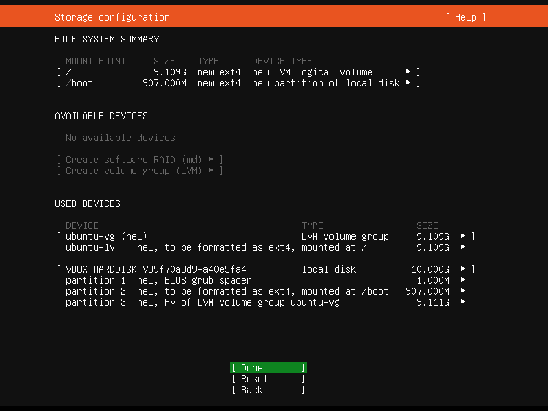

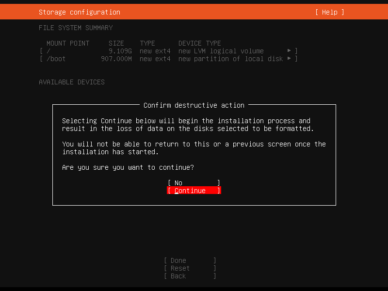

### 7.配置用户名和密码


### 8.输入 Ubuntu Advantage，一般跳过

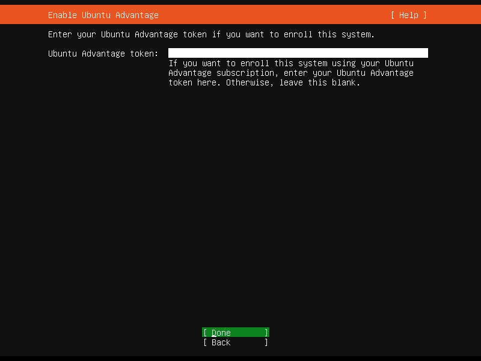

### 9.安装 OpenSSH

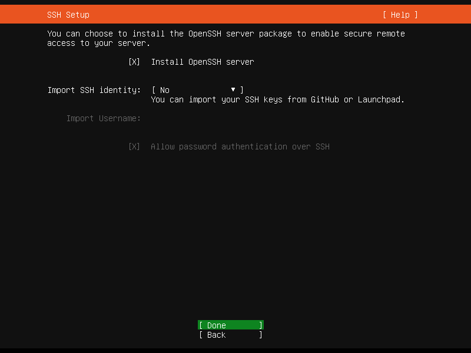

#### 10.选择需要插件

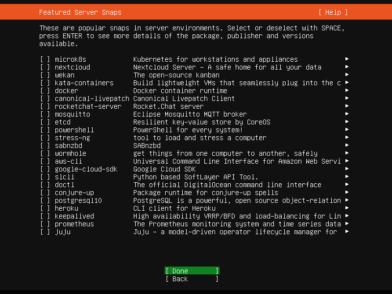

### 11.等待安装


### 12.出现 Reboot 后选择并重启

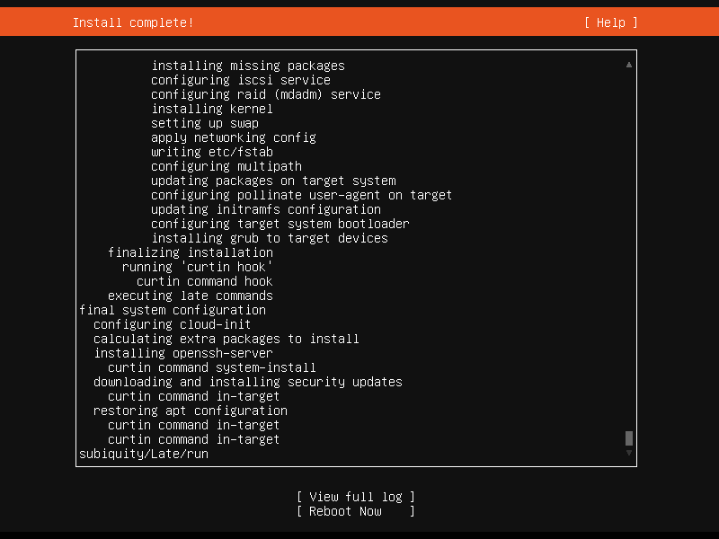

### 13.重启成功后即可登陆使用

参考配置免密登录


## 2、系统时区修改

安装完后的系统默认是 UTC 时区，需要修改到国内

### 通过命令设置：tzselect

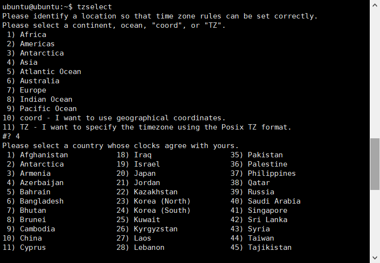

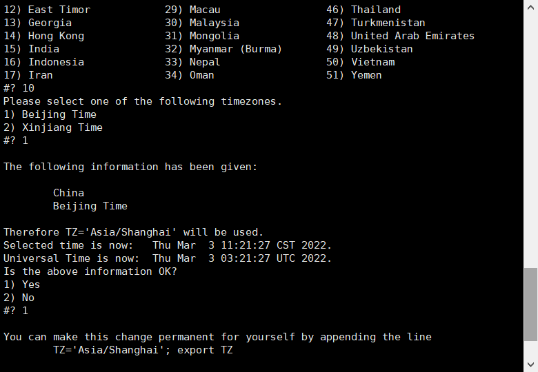


按照图片依次执行完后，发现时区任然没有更改

```shell
ubuntu@ubuntu:~$ date -R
Thu, 03 Mar 2022 03:25:35 +0000
```

### 复制时间文件

```shell
ubuntu@ubuntu:~$ sudo cp /usr/share/zoneinfo/Asia/Shanghai /etc/localtime
[sudo] password for ubuntu:
ubuntu@ubuntu:~$ date -R
Thu, 03 Mar 2022 11:27:40 +0800
```

执行完成后时间显示正常

## 3、修改 DNS

国内目前 DNS 污染严重，修改 DNS 可以有效解决部分网络问题

使用 nslookup 命令查看当前 DNS:

```shell
ubuntu@ubuntu:~$ nslookup qq.coom
Server:		127.0.0.53
Address:	127.0.0.53#53
```

目前版本 Ubuntu 默认启用`systemd-resolved`DNS 为 127.0.0.53

**首先修改 /etc/systemd/resolved.conf 文件，在其中添加 dns 信息，例如：**

`DNS=8.8.8.8 114.114.114.114`

然后退出保存

**然后以 root 身份在 ubuntu 终端中依次执行如下命令：**

```shell
systemctl restart systemd-resolved
systemctl enable systemd-resolved
```

此时新增的 DNS 已经增加到`systemd-resolved`中可以使用下面命令查看：

```shell
$ systemd-resolve --status

Global
       LLMNR setting: no
MulticastDNS setting: no
  DNSOverTLS setting: no
      DNSSEC setting: no
    DNSSEC supported: no
         DNS Servers: 8.8.8.8
                      114.114.114.114
```

但是**nslookup**仍然显示 127.0.0.53，使用下面命令可以强制 DNS 更改

```shell
mv /etc/resolv.conf  /etc/resolv.conf.bak
ln -s /run/systemd/resolve/resolv.conf /etc/
```

再查看**nslookup**:

```shell
ubuntu@ubuntu:~$ nslookup qq.com
Server:		114.114.114.114
Address:	114.114.114.114#53
```

::: tip 提示

也可直接在网络配置里更改，配置文件在`/etc/netplan`打开后添加**nameservers**即可：

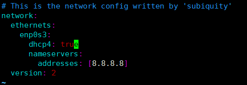

:::

## 4、删除 snap

虽然 snap 具有众多有点，但是我们是服务器不需要这些功能，而且使用 snap 还会带来额外的困扰，比如使用 top 查看能发现 snapd 常年占据较高的使用率，因此我们决定卸载 snap 服务。

使用如下命令卸载：

`sudo apt autoremove --purge snapd`

提示执行成功了：

```shell
Reading package lists... Done
Building dependency tree
Reading state information... Done
The following packages will be REMOVED:
  snapd* squashfs-tools*
0 upgraded, 0 newly installed, 2 to remove and 1 not upgraded.
After this operation, 147 MB disk space will be freed.
Do you want to continue? [Y/n] y
(Reading database ... 73313 files and directories currently installed.)
Removing snapd (2.54.3+20.04.1ubuntu0.2) ...
Stopping snap.lxd.activate.service
Stopping unit snap.lxd.activate.service
Waiting until unit snap.lxd.activate.service is stopped [attempt 1]
snap.lxd.activate.service is stopped.
Stopping snap.lxd.daemon.service
Stopping unit snap.lxd.daemon.service
Waiting until unit snap.lxd.daemon.service is stopped [attempt 1]
snap.lxd.daemon.service is stopped.
Stopping snap.lxd.daemon.unix.socket
Stopping unit snap.lxd.daemon.unix.socket
Waiting until unit snap.lxd.daemon.unix.socket is stopped [attempt 1]
snap.lxd.daemon.unix.socket is stopped.
Removing squashfs-tools (1:4.4-1ubuntu0.3) ...
Processing triggers for man-db (2.9.1-1) ...
Processing triggers for dbus (1.12.16-2ubuntu2.1) ...
Processing triggers for mime-support (3.64ubuntu1) ...
(Reading database ... 73221 files and directories currently installed.)
Purging configuration files for snapd (2.54.3+20.04.1ubuntu0.2) ...
Stopping snap.lxd.activate.service
Stopping unit snap.lxd.activate.service
Waiting until unit snap.lxd.activate.service is stopped [attempt 1]
snap.lxd.activate.service is stopped.
Removing snap.lxd.activate.service
Stopping snap.lxd.daemon.service
Stopping unit snap.lxd.daemon.service
Waiting until unit snap.lxd.daemon.service is stopped [attempt 1]
snap.lxd.daemon.service is stopped.
Removing snap.lxd.daemon.service
Stopping snap-core20-1328.mount
Stopping unit snap-core20-1328.mount
Waiting until unit snap-core20-1328.mount is stopped [attempt 1]
snap-core20-1328.mount is stopped.
Removing snap core20 and revision 1328
Removing snap-core20-1328.mount
Stopping snap-core20-1361.mount
Stopping unit snap-core20-1361.mount
Waiting until unit snap-core20-1361.mount is stopped [attempt 1]
snap-core20-1361.mount is stopped.
Removing snap core20 and revision 1361
Removing snap-core20-1361.mount
Stopping snap-lxd-21835.mount
Stopping unit snap-lxd-21835.mount
Waiting until unit snap-lxd-21835.mount is stopped [attempt 1]
snap-lxd-21835.mount is stopped.
Removing snap lxd and revision 21835
Stopping unit snap.lxd.daemon.unix.socket
Waiting until unit snap.lxd.daemon.unix.socket is stopped [attempt 1]
snap.lxd.daemon.unix.socket is stopped.
Stopping unit snap.lxd.daemon.unix.socket
Warning: The unit file, source configuration file or drop-ins of snap.lxd.daemon.unix.socket changed on disk. Run 'systemctl daemon-reload' to reload units.
Waiting until unit snap.lxd.daemon.unix.socket is stopped [attempt 1]
snap.lxd.daemon.unix.socket is stopped.
Removing snap-lxd-21835.mount
Stopping snap-snapd-14978.mount
Stopping unit snap-snapd-14978.mount
Waiting until unit snap-snapd-14978.mount is stopped [attempt 1]
snap-snapd-14978.mount is stopped.
Removing snap snapd and revision 14978
Removing snap-snapd-14978.mount
Discarding preserved snap namespaces
Final directory cleanup
Removing extra snap-confine apparmor rules
Removing snapd cache
Removing snapd state
```
